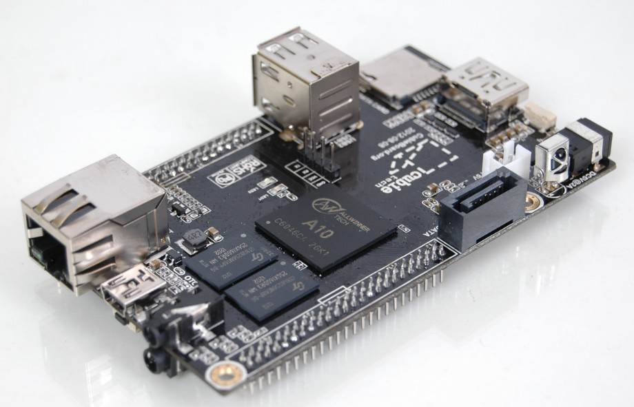

# Cubieboard A10

**Manufacturer	CubieTech, Cubieboard**

**Dimensions	10cm x 6cm**

**Release Date	October 2012**

### Hardware Specs
AllWinnerTech SOC A10?ARM® Cortex™-A8 ARM® Mali400 MP1 Complies with OpenGL ES 2.0/1.1

1GB DDR3 @480MHz

4GB internal NAND flash, up to 32GB on SD slot, up to 2T on 2.5 SATA disk

5VDC input 2A or USB otg input

1x 10/100 ethernet, support usb wifi

2x USB 2.0 HOST, 1x mini USB 2.0 OTG, 1x micro sd

1x HDMI 1080P display output

1x IR, 1x line in, 1x line out

96 extend pin interface, including I2C, SPI, RGB/LVDS, CSI/TS, FM-IN, ADC, CVBS, VGA, SPDIF-OUT, R-TP, and more

## Links
[linux-sunxi.org Cubieboard](http://linux-sunxi.org/Cubieboard)

[CubieBoard Forum](http://www.cubieforums.com/)

[CubieBoard Forum](http://www.cubieforums.com/)

## Images
[Images_Ubuntu](https://linux-sunxi.org/Cubieboard/Images_Ubuntu)

[Cubieboard1 porting to cm-10.1(android-4.2.2)](https://github.com/jungleji/android_device_softwinner_cubieboard1)

[Installing_androidtv_for_cubieboard](http://docs.cubieboard.org/tutorials/cb1/installation/installing_androidtv_for_cubieboard)

**User&passwd**

-user: cubie passwd:cubieboard

-user: root  passwd:cubieboard 

## Device firmware
1. Install Livesuit or PhoenixSuit

2. Enter FEL Mode

3. Press the FEL key when power up(the FEL key is the one under the USB OTG port), The CPU automatically enters FEL mode. Livesuit will start to write the image to Nand on board.

## Tools
[LiveSuit](http://linux-sunxi.org/LiveSuite)

[Install Livesuit or PhoenixSuit](http://docs.cubieboard.org/tutorials/cb1/installation/cb1_android_4.0.x_nand_install)
